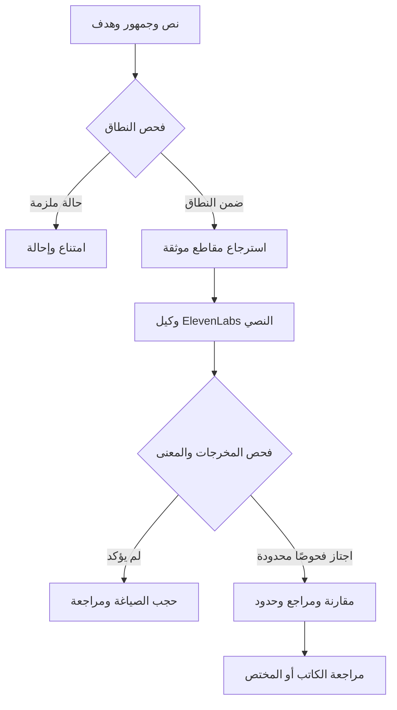

# معمارية وِصال 2.0

الواجهة Static Site على Render؛ الخادم Express/Node. الاسترجاع المحلي مستقل عن إعداد RAG الخاص بالوكيل، لذلك يمكن للجنة فحص corpus والخوارزمية والسياق المرسل. لا ندعي معرفة اسم نموذج LLM داخل حساب ElevenLabs أو إعداداته الخاصة؛ المتاح لنا هو هوية الوكيل وواجهته العامة. معرف الوكيل ليس مفتاحًا سريًا.

## الاسترجاع
ترتيب المقاطع بالمطابقة بعد إزالة التشكيل وتوحيد أشكال الألف والياء. تُرسل أعلى مقطعين ذوي صلة. البيانات جُلبت من QuranEnc API مع تحقق السورة والآية وتاريخ الجلب. لا يُطلب من النموذج البحث في الإنترنت. نسخ مصغرة ثابتة تقلل اعتماد تشغيل التحليل على شبكة المصدر؛ تجدد بعد مراجعة المطابقة.

## الإثبات
يظهر المقطع المسترجع ونصه ورابطه. يُعد مستخدمًا عندما يذكر الوكيل معرفه في توصية؛ هذا إثبات إسناد داخل المخرج، وليس إثباتًا أن التوصية تفسير شرعي صحيح. معرفات غير مسترجعة تؤدي إلى حجب الاقتراح.

## الفحص
قواعد شكل الرد وحفظ اقتباسات محاطة بعلامات تنصيص والأرقام وبعض الأحكام المستحدثة. مراجعة دلالية ثانية عبر نفس المزود، مع reason وحالة true/false. عند غياب الفحص أو فشله لا يُعرض نجاح دلالي. المراجعة البشرية ليست مفعلة داخل النظام، ويُفصح عنها كخطوة ضرورية عند الحاجة.
